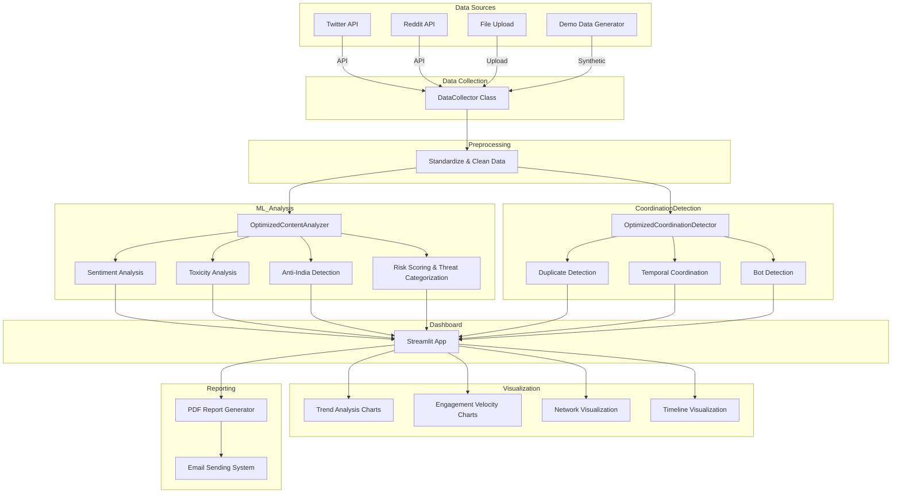

# Anti-India Campaign Detection System

## Overview

This project is an advanced **Anti-India Campaign Detection System** built with [Streamlit](https://streamlit.io/) for interactive dashboarding, machine learning-based content analysis, network graphing, and automated reporting. It is designed to identify and analyze suspicious, coordinated, or high-risk social media activity targeting India, leveraging both Twitter and Reddit data sources.

### Core Features

- **Multi-source Data Collection:** Supports Twitter API, Reddit API, file uploads (CSV, JSON, Excel), and synthetic demo data.
- **ML/NLP Analysis:** Uses transformer models for sentiment and toxicity detection, as well as rule-based systems for fallback.
- **Coordination Detection:** Identifies duplicate, temporally coordinated, and bot-driven content using clustering, similarity, and statistical methods.
- **Interactive Visualizations:** Presents advanced trend, engagement, and network graphs using Plotly with a fixed dark theme.
- **PDF & Email Reporting:** Generates comprehensive PDF reports and sends them via email using built-in SMTP.
- **Enhanced Dashboard:** Multi-tab dashboard for threat analytics, high-risk posts, coordination networks, bot analysis, and performance metrics.

---

## Architecture

### High-Level Flow



---

### Module Breakdown

- **app.py** (This file):  
  - Houses all classes, logic, and UI for the system.
  - Main modules:
    - `DataCollector`: Data ingestion from APIs, uploads, and demo generation.
    - `OptimizedContentAnalyzer`: ML/NLP model loading, batch analysis, rule-based fallback.
    - `OptimizedCoordinationDetector`: Duplicate, temporal, and bot pattern detection.
    - Visualization Functions: Trend, engagement, network, timeline, and summary charts.
    - Reporting Functions: PDF report generation, email sending, and summary text.

- **ML Models:**
  - Uses [HuggingFace Transformers](https://huggingface.co/transformers/) (`cardiffnlp/twitter-roberta-base-sentiment-latest` for sentiment, `martin-ha/toxic-comment-model` for toxicity).
  - GPU acceleration if CUDA is available.

- **Visualization:**
  - [Plotly](https://plotly.com/python/) for all charting, with a custom dark theme.
  - NetworkX for graph structure and metrics.

- **Reporting & Alerts:**
  - [fpdf2](https://pypi.org/project/fpdf2/) for PDF generation.
  - SMTP for sending email reports (Google App Password required).
  - Sidebar alert system for critical findings.

---

## Usage Instructions

1. **Install Dependencies:**
    ```bash
    pip install streamlit torch transformers plotly networkx pandas numpy scikit-learn fpdf2 tweepy praw
    ```

2. **Run the App:**
    ```bash
    streamlit run app.py
    ```

3. **Select Data Source:**
    - **Upload Dataset:** CSV, JSON, Excel (up to 100MB supported).
    - **Twitter API:** Requires Bearer Token.
    - **Reddit API:** Requires Client ID, Secret, and User Agent.
    - **Demo Data:** For quick testing, generates synthetic data.

4. **Analyze:**
    - Use dashboard buttons to run ML analysis and coordination detection.
    - Navigate tabs for detailed results.

5. **Reporting:**
    - Generate full markdown or PDF reports.
    - Configure email in sidebar (Gmail App Password required) and send report.

---

## Customization

- **Theme and Performance:**  
  Tune dark theme settings and batch/visualization size via sidebar.
- **Keywords & Patterns:**  
  Edit anti-India and suspicious phrase lists in `OptimizedContentAnalyzer`.
- **Model Selection:**  
  Swap out HuggingFace models as needed.

---

## Security & Privacy

- **API Credentials:**  
  Credentials entered in the sidebar are not stored or logged.
- **Data:**  
  Uploaded or collected data is only processed in-memory; not saved locally.

---

## Extending the System

- Add new ML models or threat patterns by extending `OptimizedContentAnalyzer`.
- Integrate additional social media APIs (e.g., Facebook, YouTube) by subclassing `DataCollector`.
- Enhance reporting outputs (HTML, Excel) using the reporting utilities.

---

## License

MIT License

---

## Contact / Support

For issues or questions, open a GitHub issue in this repository or email the maintainer.

---

## Sample Dashboard Screenshot


---

## Acknowledgments

- HuggingFace Transformers
- Streamlit
- Plotly
- NetworkX
- scikit-learn
- fpdf2
